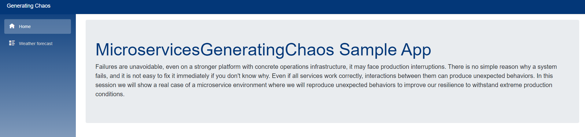

# About PoC Chaos Performance And Resiliency Testing

ERNI Academy PoC to explain how to create a .net api resilient and performan application, and how to test the resiliency and the performance by applying chaos technologies and stress tools.

<!-- ALL-CONTRIBUTORS-BADGE:START - Do not remove or modify this section -->
<!-- ALL-CONTRIBUTORS-BADGE:END -->

## Built With

To run and play with this poc you need to install the following tools:

- [Visual Studio](https://visualstudio.microsoft.com/)
- [Visual Studio Code](https://visualstudio.microsoft.com/)
- [Azure cli](https://docs.microsoft.com/en-us/cli/azure/)
- [Gatling](https://gatling.io/open-source/)
- [Terraform](https://learn.hashicorp.com/tutorials/terraform/install-cli)

## Getting Started

Before to start with this POC repository some preliminar literature has to be read.

- [Implement resilient applications](https://docs.microsoft.com/en-us/dotnet/architecture/microservices/implement-resilient-applications/)
- [Best practices to build and maintain resilient applications and infrastructure](https://thenewstack.io/7-best-practices-to-build-and-maintain-resilient-applications-and-infrastructure/)
- [Chaos Principles](http://principlesofchaos.org/?lang=ENcontent)
- [Netflix Chaos monkey](https://netflix.github.io/chaosmonkey/)
- [Kube-monkey](https://github.com/asobti/kube-monkey)
- [Gatling home page](https://gatling.io/)
- [Polly](https://github.com/App-vNext/Polly)
- [CQRS](https://martinfowler.com/bliki/CQRS.html)
- [Redis](https://redis.io/documentation)


In this POC we created a simple UI interface that triggers data from a backend microservice that consume another one to retrieve the weather simulating an external weather service

The idea is to show how to have a HA (High Availability) application. For this reason we choose a [Microservice architecture](https://en.wikipedia.org/wiki/Microservices) deployed on a [Kubernetes](https://en.wikipedia.org/wiki/Kubernetes) environment in Azure. But you can deploy it to another K8s cloud provider by modifying the terraform scripts.

**How we can have a resilient application?**\
The application have to respone any time so by implementing:
- The Cache strategies (https://docs.microsoft.com/en-us/azure/architecture/best-practices/caching)\
\
  Cache servers have the benefit that are much more faster and ready than a DB. So by habing between the code and the DB a cache mechanism will save time to response any request and our application will experience better performance.

- Retry policies: In the cloud, services may not always be ready to be consumed or can have a lot of load so a retry policy patterns needs to be applied. In our case, since is a .net sample we used [Polly](https://github.com/App-vNext/Polly) to do so.

- Apply CQRS pattern: Having Commands (write to the application) separated from the Queries (read from the application) allows to have better distribution of the loads. On each channel we can apply also the previous and if your application require more resource in the read than on the write you adjust the proposed scripts for it.

- Microservice architecture: That type of architecture allows you to create small applications that represents your 

## Run the project

### Run the project localy:

1. Clone the repo

   ```sh
   git clone https://github.com/ERNI-Academy/poc-chaos-preformance-resiliency-testing.git
   ```

2. Open the solution with the Visual studio
3. Recompile the solution
4. Run the solution
5. Open the browser at [http://localhost:5000](http://localhost:5000) to see the UI \
   \


6. Open the browser at [http://localhost:5001](http://localhost:5001) to see the Swagger API\
   

7. Download Gatling on your local machine: [https://gatling.io/open-source/](https://gatling.io/open-source/)
8. Unzip it
9. Copy the .\src\3.Gatling\simulationscripts\simulations\ApiBehavior.local.scala to <-- Gatling Installation Path -->\user-files\simulations
10. Run the Gatling app from <-- Gatling Installation Path -->\bin\ use the gatling.bat for windows or gatling.sh for linux
11. Select the sample **test.api.ApiBehaviorLocal**
12. After a while runing you will get the a report similar to that:\


### Run the project in Azure (you can choose any other provider)

Since we are runing on a Docker-compose we can not start killing the infrastructure so for that let install the project into a AKS service.
1. Create an Azure Account [https://azure.microsoft.com/en-us/](https://azure.microsoft.com/en-us/)
2. Open command prompt 
3. Loging to azure with the following command:\
```bash
az login
```
4. The browser will open a login screen where you can enter your credentials
5. Get all your subscriptions:\
```bash
az account subscription list
``` 
6.Get your "subscriptionId" and set it as the current one by:
```bash
az account set --subscription=YOUR SUBSCRIPTION ID
```
7. Navigate to .\scripts\terraform
8. Edit the main.tf file and update the values < desidered region >, < Your Container Registry Name > and < Your k8s Cluster Name > by the one that you prefer
8. We will deploy the infrastructure needed with the following commands to Azure:    
```bash
# Initialize Terraform
terraform init

# Plan the infrastructure
terraform plan

# Apply it to the Azure
terraform apply
```
9. One the infrastructure is deployed you can navigate to the [azure portal](https://portal.azure.com) and in your subscription you will see the following Resource Groups created:

10. if you navigate to the **GeneratingChaosResourceGroup** you will see the following services deployed:

11. We need a Container registry to store our Docker images and the Kubernetes service to run the infrastructure. Now that all is created let's deploy the sample app, gatling and Kube-monkey

12. Deploy the Sample App:
```bash
# Rename the local docker images to push them to the cloud

docker tag microservicesgeneratingchaosservicesweather:latest <Your Container Registry>.azurecr.io/microservices.generatingchaos.services.weather:latest
docker tag microservicesgeneratingchaosservicesapi:latest <Your Container Registry>.azurecr.io/microservices.generatingchaos.services.api:latest
docker tag microservicesgeneratingchaosui:latest <Your Container Registry>.azurecr.io/microservices.generatingchaos.ui:latest

# Login to your container registry
docker login <Your Container Registry>.azurecr.io

# Push images to the container registry
docker push <Your Container Registry>.azurecr.io/microservices.generatingchaos.services.weather:latest
docker push <Your Container Registry>.azurecr.io/microservices.generatingchaos.services.api:latest
docker push <Your Container Registry>.azurecr.io/microservices.generatingchaos.ui:latest

# Deploy the Namespace where all will run
kubectl apply -f 1.Namespace.yml

# Deploy the cluster role binding
kubectl apply -f 2.ClusterRoleBinding.yml

# Deploy the Redis caches:
# Deploy the Weather service Redis cache
kubectl apply -f 3.RedisService.yml

# Deploy the Api Service Redis cache 
kubectl apply -f 4.RedisApi.yml

# Deploy MongoDb in replicaset mode for HA
kubectl apply -f 5.Mongo.yml

# Deploy the weather service
kubectl apply -f 6.WeatherService.yml

# Deploy the Api service
kubectl apply -f 7.ApiService.yml

# Finally deploy the UI
kubectl apply -f 8.UI.yml
```
13. Go to Azure portal and navigate to GeneratingChaosCluster
14. Go to Services and ingresses and there you will see the IP of the UI and browse it to check that the app works.

### Now let's stress the system by using gatling to generate trafic
1. Go to the folder .\src\3.Gatling
2. Create Docker image
```bash
docker build -t <your container registry>.azurecr.io/microservices.generatingchaos.gatling -f Dockerfile .
```
3.Push the docke file to the container registry
```bash
docker push <your container registry>.azurecr.io/microservices.generatingchaos.gatling
```
4. Get k8s nodes
```bash
kubectl get nodes
```
5. Select the node that will host gatling
```bash
kubectl label nodes <Selected Node Name> gatling=true
```
6. Go to folder .\scripts\k8s\gatling
7. Deploy gatling tool to stress the system with the samples
```bash
kubectl apply -f gatling-job.yml
```
8. Find the Gatling pod
```bash
kubectl get pods -n generating-chaos
``` 
9. Get the logs of the Gatling pod
```bash
kubectl logs <your gatling pod> -n generating-chaos -f
```
10. When the job finishes in the logs will tell you that the report is upload to https://transfer.sh. Go to the result URL and get your report
11. Delete gatling job
```bash
kubectl delete -f gatling-job.yml
```

### Now let's try to break the infrastructure while we stress the system
1. Go to the folder .\scripts\k8s\kube-monkey
2. Deploy [Kube-monkey](https://github.com/asobti/kube-monkey) to our k8s
```bash
# Deploy the cluster role binding
kubectl apply -f 1.cluster-role-binding.yml

# Deploy the Kube-Monkey configuration
kubectl apply -f 2.configmap.yml

# Deploy Kube-Monkey
kubectl apply -f 3.deployment.yml
```
3.Now that kube-monkey will start killing pods deploy gatling again to stress more the system
4. Go to folder .\scripts\k8s\gatling
5. Deploy gatling tool to stress the system with the samples
```bash
kubectl apply -f gatling-job.yml
```
6. Find the Gatling pod
```bash
kubectl get pods -n generating-chaos
``` 
7. Get the logs of the Gatling pod
```bash
kubectl logs gatlingapibehavior-7gwnn -n generating-chaos -f
```
8. When the job finishes in the logs will tell you that the report is upload to https://transfer.sh. Go to the result URL and get your report
9. Delete gatling job
```bash
kubectl delete -f gatling-job.yml
```

Compare the result to see how good is the response of the api while the system is getting under a lot of pressure.

### Sample app resiliency
#### retry mechanism
##### UI
See ApiService.cs class

As you can see al the get methods are encapsulated with the polly actions so like this if the api fails it tries 5 times automatically before return a fail.

##### API
See the RepositoryBase.cs where we implemented the retry policy to query the DB


### Cache mechanism
#### API
See the WeatherController.cs

As you can see there first we try to get the data from the cache and if is not there then from the DB.

To add even more resiliency and better performance we encourage you to add [CQRS](https://martinfowler.com/bliki/CQRS.html) to this sample app


There is also a powerpoint presentation where we add some more details. go to .\docs\

## Contributing

Please see our [Contribution Guide](CONTRIBUTING.md) to learn how to contribute.

## License


(LICENSE) © 2022 [ERNI - Swiss Software Engineering](https://www.betterask.erni)

## Code of conduct

Please see our [Code of Conduct](CODE_OF_CONDUCT.md)

## Stats

Check [https://repobeats.axiom.co/](https://repobeats.axiom.co/) for the right URL

## Follow us

[](https://www.twitter.com/ERNI)
[](https://www.twitch.tv/erni_academy)
[](https://www.youtube.com/channel/UCkdDcxjml85-Ydn7Dc577WQ)
[](https://www.linkedin.com/company/erni)

## Contact

📧 [esp-services@betterask.erni](mailto:esp-services@betterask.erni)

## Contributors ✨

Thanks goes to these wonderful people ([emoji key](https://allcontributors.org/docs/en/emoji-key)):

<!-- ALL-CONTRIBUTORS-LIST:START - Do not remove or modify this section -->
<!-- ALL-CONTRIBUTORS-LIST:END -->
This project follows the [all-contributors](https://github.com/all-contributors/all-contributors) specification. Contributions of any kind welcome!
